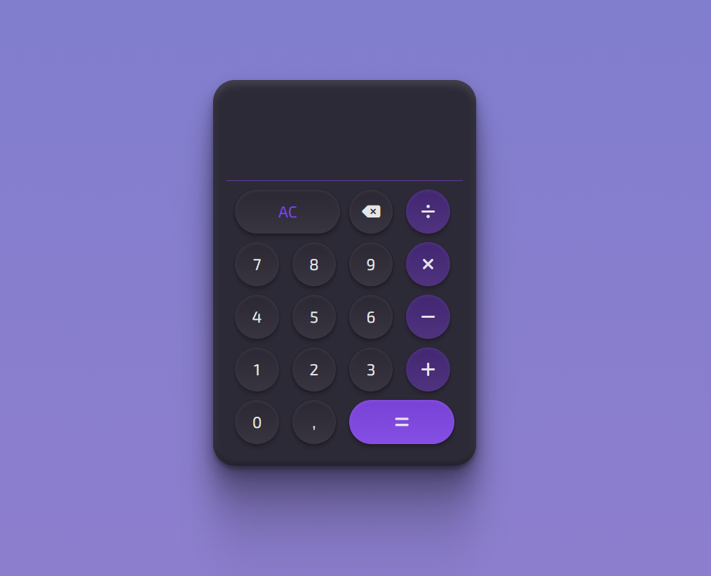
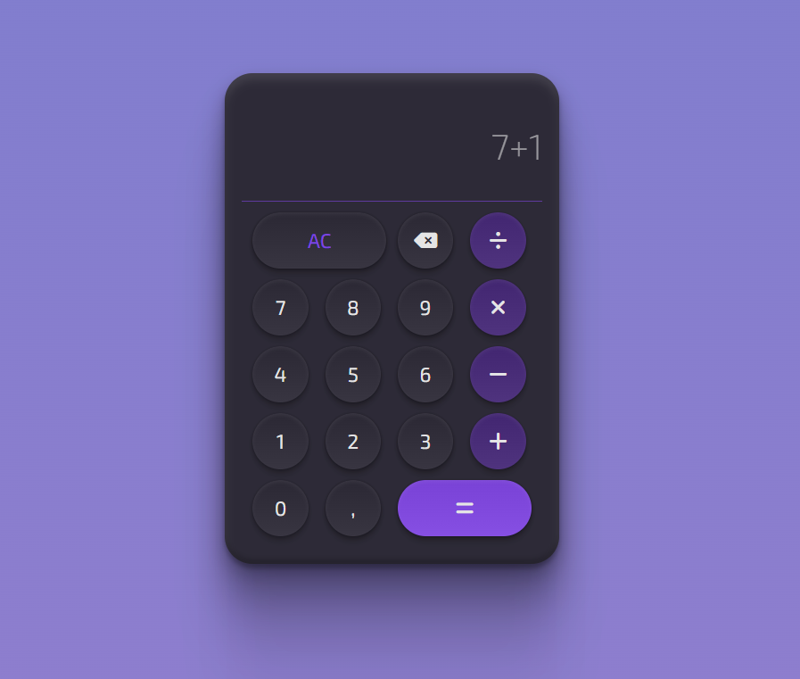

## Calculadora

## Projeto desenvolvido com HTML, CSS E JS.

### O projeto permite a operação de operações básicas.

    <ul>
        <li>Soma</li>
        <li>Subtração</li>
        <li>Multiplicação</li>
        <li>Divisão</li>
    </ul>

